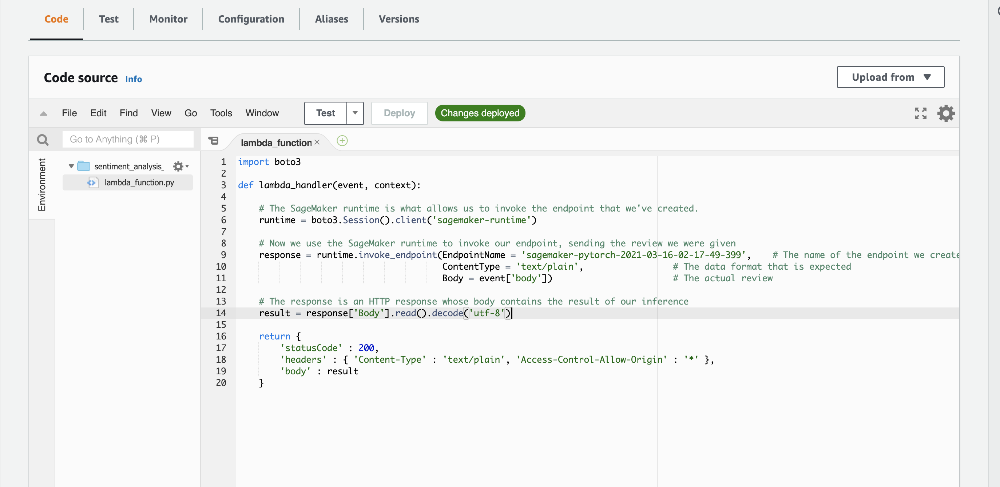
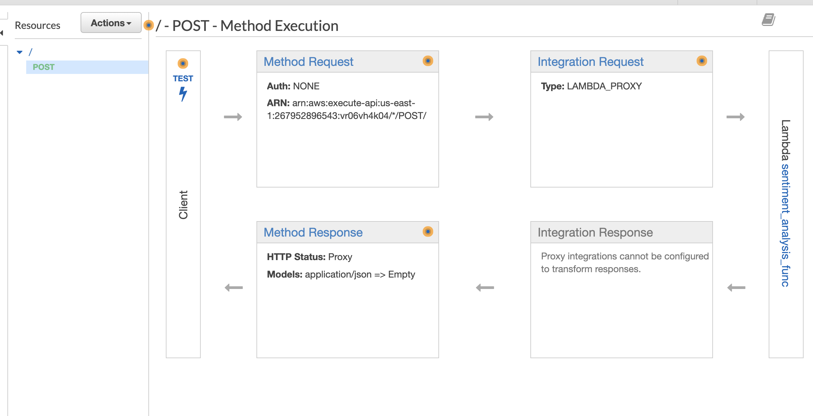

# Creating a Sentiment Analysis Web App using PyTorch and SageMaker


The diagram above gives an overview of how the various services will work together. On the far right is the model which we trained above and which is deployed using SageMaker. On the far left is our web app that collects a user's movie review, sends it off and expects a positive or negative sentiment in return.

In the middle is where some of the magic happens. We will construct a Lambda function, which you can think of as a straightforward Python function that can be executed whenever a specified event occurs. We will give this function permission to send and recieve data from a SageMaker endpoint.

Lastly, the method we will use to execute the Lambda function is a new endpoint that we will create using API Gateway. This endpoint will be a url that listens for data to be sent to it. Once it gets some data it will pass that data on to the Lambda function and then return whatever the Lambda function returns. Essentially it will act as an interface that lets our web app communicate with the Lambda function.

You can find an example from AWS [here](https://aws.amazon.com/blogs/machine-learning/call-an-amazon-sagemaker-model-endpoint-using-amazon-api-gateway-and-aws-lambda/)

## Overall Project Process

In this project we will be using the [IMDb dataset](http://ai.stanford.edu/~amaas/data/sentiment/)

> Maas, Andrew L., et al. [Learning Word Vectors for Sentiment Analysis](http://ai.stanford.edu/~amaas/data/sentiment/). In *Proceedings of the 49th Annual Meeting of the Association for Computational Linguistics: Human Language Technologies*. Association for Computational Linguistics, 2011.

1. Start a SageMaker Notebook Instance to perform the following
   1. Get IMDB data into the local instance
   2. Preprocess the data using Natural Language Processing (NLP) techniques 
   3. Create our Test/Train/Validation sets 
   4. Push our data sets to S3 bucket
   5. Train our LSTM (PyTorch) model 
   6. Test our Model 
   7. **Deploy** our model and establish a SageMaker EndPoint
2. Create a **Lambda** function that invokes the SageMaker EndPoint, sends a requests (some text review), then return the response (prediction) 
3. Create an **API Gateway** which invokes the Lambda function. The API Gateway allows for external communication through the API, which invokes the Lambda function from an HTML website passing some text data, which the Lambda function then pushed to the SageMaker EndPoint hitting the Sentiment Model to return a prediction. 


## AWS Lambda

### Setting up a Lambda function

The first thing we are going to do is set up a Lambda function. This Lambda function will be executed whenever our public API has data sent to it. When it is executed it will receive the data, perform any sort of processing that is required, send the data (the review) to the SageMaker endpoint we've created and then return the result.

#### Part A: Create an IAM Role for the Lambda function

Since we want the Lambda function to call a SageMaker endpoint, we need to make sure that it has permission to do so. To do this, we will construct a role that we can later give the Lambda function.

Using the AWS Console, navigate to the **IAM** page and click on **Roles**. Then, click on **Create role**. Make sure that the **AWS service** is the type of trusted entity selected and choose **Lambda** as the service that will use this role, then click **Next: Permissions**.

In the search box type `sagemaker` and select the check box next to the **AmazonSageMakerFullAccess** policy. Then, click on **Next: Review**.

Lastly, give this role a name. Make sure you use a name that you will remember later on, for example `LambdaSageMakerRole`. Then, click on **Create role**.

#### Part B: Create a Lambda function

Now it is time to actually create the Lambda function.

Using the AWS Console, navigate to the AWS Lambda page and click on **Create a function**. When you get to the next page, make sure that **Author from scratch** is selected. Now, name your Lambda function, using a name that you will remember later on, for example `sentiment_analysis_func`. Make sure that the **Python 3.6** runtime is selected and then choose the role that you created in the previous part. Then, click on **Create Function**.

On the next page you will see some information about the Lambda function you've just created. If you scroll down you should see an editor in which you can write the code that will be executed when your Lambda function is triggered. In our example, we will use the code below.

```python
import boto3

def lambda_handler(event, context):

    # The SageMaker runtime is what allows us to invoke the endpoint that we've created.
    runtime = boto3.Session().client('sagemaker-runtime')

    # Now we use the SageMaker runtime to invoke our endpoint, sending the review we were given
    response = runtime.invoke_endpoint(EndpointName = 'sagemaker-pytorch-2021-03-16-02-17-49-399',    # The name of the endpoint we created
                                       ContentType = 'text/plain',                 # The data format that is expected
                                       Body = event['body'])                       # The actual review

    # The response is an HTTP response whose body contains the result of our inference
    result = response['Body'].read().decode('utf-8')

    return {
        'statusCode' : 200,
        'headers' : { 'Content-Type' : 'text/plain', 'Access-Control-Allow-Origin' : '*' },
        'body' : result
    }
```





## AWS Gateway

### Setting up API Gateway

Now that our Lambda function is set up, it is time to create a new API using API Gateway that will trigger the Lambda function we have just created.

Using AWS Console, navigate to **Amazon API Gateway** and then click on **Get started**.

On the next page, make sure that **New API** is selected and give the new api a name, for example, `sentiment_analysis_api`. Then, click on **Create API**.

Now we have created an API, however it doesn't currently do anything. What we want it to do is to trigger the Lambda function that we created earlier.

Select the **Actions** dropdown menu and click **Create Method**. A new blank method will be created, select its dropdown menu and select **POST**, then click on the check mark beside it.

For the integration point, make sure that **Lambda Function** is selected and click on the **Use Lambda Proxy integration**. This option makes sure that the data that is sent to the API is then sent directly to the Lambda function with no processing. It also means that the return value must be a proper response object as it will also not be processed by API Gateway.

Type the name of the Lambda function you created earlier into the **Lambda Function** text entry box and then click on **Save**. Click on **OK** in the pop-up box that then appears, giving permission to API Gateway to invoke the Lambda function you created.

The last step in creating the API Gateway is to select the **Actions** dropdown and click on **Deploy API**. You will need to create a new Deployment stage and name it anything you like, for example `prod`.

You have now successfully set up a public API to access your SageMaker model. Make sure to copy or write down the URL provided to invoke your newly created public API as this will be needed in the next step. This URL can be found at the top of the page, highlighted in blue next to the text **Invoke URL**.




## HTML Example

```html
<!DOCTYPE html>
<html lang="en">
    <head>
        <title>Sentiment Analysis Web App</title>
        <meta charset="utf-8">
        <meta name="viewport"  content="width=device-width, initial-scale=1">
        <link rel="stylesheet" href="https://maxcdn.bootstrapcdn.com/bootstrap/3.3.7/css/bootstrap.min.css">
        <script src="https://ajax.googleapis.com/ajax/libs/jquery/3.3.1/jquery.min.js"></script>
        <script src="https://maxcdn.bootstrapcdn.com/bootstrap/3.3.7/js/bootstrap.min.js"></script>

        <script>
         "use strict";
         function submitForm(oFormElement) {
             var xhr = new XMLHttpRequest();
             xhr.onload = function() {
                 var result = parseFloat(xhr.responseText);
                 var resultElement = document.getElementById('result');
                 if (result == 0) {
                     resultElement.className = 'bg-danger';
                     resultElement.innerHTML = 'Your review was NEGATIVE!';
                 } else {
                     resultElement.className = 'bg-success';
                     resultElement.innerHTML = 'Your review was POSITIVE!';
                 }
             }
             xhr.open (oFormElement.method, oFormElement.action, true);
             var review = document.getElementById('review');
             xhr.send (review.value);
             return false;
         }
        </script>

    </head>
    <body>

        <div class="container">
            <h1>Is your review positive, or negative?</h1>
            <p>Enter your review below and click submit to find out...</p>
            <form method="POST"
                  action="https://vr06vh4k04.execute-api.us-east-1.amazonaws.com/prod"
                  onsubmit="return submitForm(this);" >                     <!-- HERE IS WHERE YOU NEED TO ENTER THE API URL -->
                <div class="form-group">
                    <label for="review">Review:</label>
                    <textarea class="form-control"  rows="5" id="review">Please write your review here.</textarea>
                </div>
                <button type="submit" class="btn btn-default">Submit</button>
            </form>
            <h1 class="bg-success" id="result"></h1>
        </div>
    </body>
</html>

```

**Example of passing a Review to our deployed model on SageMaker Endpoint**


